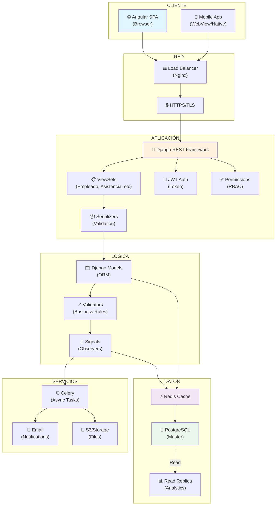

# 🏗️ ARQUITECTURA - ESTILOS, PATRONES Y DECISIONES

## 1. ESTILO ARQUITECTÓNICO GENERAL

### 📐 N-Tier (Arquitectura en Capas)

```
┌─────────────────────────────────────┐
│    Capa de Presentación             │  ← Angular 18+ (Frontend SPA)
│  (UI Components, Routing, State)    │
├─────────────────────────────────────┤
│    Capa de Distribución             │  ← HTTP/REST API
│  (Serializers, Validación)          │
├─────────────────────────────────────┤
│    Capa de Lógica de Negocio        │  ← Django ViewSets, Services
│  (Rules, Workflows, Permissions)    │
├─────────────────────────────────────┤
│    Capa de Acceso a Datos           │  ← Django ORM, Managers
│  (Queries, Transactions)            │
├─────────────────────────────────────┤
│    Capa de Persistencia             │  ← PostgreSQL
│  (Database, Indexes, Constraints)   │
└─────────────────────────────────────┘
```

### 🏢 Estilo SaaS (Software as a Service)

```
┌─────────────────────────────────────────────┐
│          CLOUD INFRASTRUCTURE               │
│  (Hosting, Database, Static Files)          │
├─────────────────────────────────────────────┤
│                                             │
│  ┌──────────┬──────────┬──────────┐        │
│  │ Empresa1 │ Empresa2 │ Empresa3 │...     │
│  │  Tenant  │  Tenant  │  Tenant  │        │
│  └──────────┴──────────┴──────────┘        │
│                                             │
│  Shared Application Layer (Multi-tenant)    │
│  Shared Database (Data Isolation by ID)     │
│                                             │
└─────────────────────────────────────────────┘
```

**Características SaaS:**
- ✅ Single Instance, Multi-Tenant Database
- ✅ Data Isolation por `empresa_id` a nivel QuerySet
- ✅ Escalabilidad horizontal via load balancing
- ✅ Mantenimiento centralizado
- ✅ Actualizaciones simultáneas para todos los tenants

---

## 2. PATRÓN ARQUITECTÓNICO

### 🔷 Model-View-Template-Controller (MVTC) - Hybrid

PuntoPymes combina **MVT (Django)** con **MVC (Angular)**.

#### Backend: MVT (Django)

```
┌─────────────────────────────────────────────────────┐
│                     FRONTEND (SPA)                  │
│  Angular + TypeScript + RxJS + Tailwind CSS         │
└────────────────────┬────────────────────────────────┘
                     │ HTTP/JSON REST
┌────────────────────▼────────────────────────────────┐
│             Django REST Framework                   │
│                                                     │
│  ┌──────────────────────────────────────────────┐  │
│  │ Views/ViewSets (Lógica HTTP)                │  │
│  │  - EmployadoViewSet                         │  │
│  │  - AsistenciaViewSet                        │  │
│  │  - TareaViewSet                             │  │
│  └──────────────────────────────────────────────┘  │
│                      ↓                              │
│  ┌──────────────────────────────────────────────┐  │
│  │ Serializers (Transformación de datos)       │  │
│  │  - EmployadoSerializer                      │  │
│  │  - EventoAsistenciaSerializer               │  │
│  │  - TareaSerializer                          │  │
│  └──────────────────────────────────────────────┘  │
│                      ↓                              │
│  ┌──────────────────────────────────────────────┐  │
│  │ Models (ORM - Acceso a Datos)               │  │
│  │  - Empleado, EventoAsistencia, Tarea        │  │
│  │  - Empresa, Sucursal, Departamento          │  │
│  │  - SolicitudAusencia, KPI, Objetivo         │  │
│  └──────────────────────────────────────────────┘  │
│                      ↓                              │
│  ┌──────────────────────────────────────────────┐  │
│  │ Database (PostgreSQL)                       │  │
│  │  - Tables, Indexes, Constraints             │  │
│  └──────────────────────────────────────────────┘  │
└─────────────────────────────────────────────────────┘
```

#### Frontend: MVC (Angular)

```
┌──────────────────────────────────────────┐
│         Angular Components               │  ← View (Templates HTML)
│  (Dashboard, EmpleadoForm, etc)          │
├──────────────────────────────────────────┤
│         Services (RxJS)                  │  ← Model (Data + Logic)
│  (EmployadoService, AsistenciaService)   │
├──────────────────────────────────────────┤
│         Components TypeScript            │  ← Controller (Logic)
│  (Handlers, State, Routing)              │
└──────────────────────────────────────────┘
          ↓ Interactúan con ↑
       Django API REST
```

---

## 3. PATRONES DE DISEÑO IMPLEMENTADOS

### 🔵 Singleton

**Uso:** Instancias únicas del sistema

```python
# ConfiguracionNomina
class ConfiguracionNomina(models.Model):
    empresa = models.OneToOneField(Empresa)
    # Garantiza una sola config por empresa
    
    class Meta:
        constraints = [
            models.UniqueConstraint(
                fields=['empresa'], 
                name='una_config_por_empresa'
            )
        ]
```

**Aplicación:** 
- Configuración global por Empresa
- Parámetros de nómina (factor HE, moneda, etc.)

---

### 🔶 Factory Pattern

**Uso:** Creación de objetos complejos

```python
# En ViewSets - Creación de Jornada desde EventoAsistencia
class JornadaFactory:
    @staticmethod
    def crear_desde_eventos(empleado, fecha):
        """Factory para consolidar EventoAsistencia → Jornada"""
        eventos = EventoAsistencia.objects.filter(
            empleado=empleado,
            timestamp__date=fecha
        )
        entrada = eventos.filter(tipo='ENTRADA').first()
        salida = eventos.filter(tipo='SALIDA').first()
        
        jornada = Jornada(
            empleado=empleado,
            fecha=fecha,
            entrada=entrada.timestamp,
            salida=salida.timestamp
        )
        return jornada
```

**Aplicación:**
- Creación de Jornadas
- Generación de Nóminas
- Creación de Evaluaciones

---

### 🟠 Observer Pattern

**Uso:** Notificaciones y eventos del sistema

```python
# En models.py - Signals de Django
from django.db.models.signals import post_save
from django.dispatch import receiver

@receiver(post_save, sender=SolicitudAusencia)
def notificar_ausencia_creada(sender, instance, created, **kwargs):
    """Observer: Cuando se crea una solicitud, notificar al gerente"""
    if created:
        Notificacion.objects.create(
            usuario_destino=instance.empleado.supervisor,
            titulo="Nueva solicitud de ausencia",
            mensaje=f"{instance.empleado} solicita {instance.dias_solicitados} días",
            tipo='SISTEMA'
        )

@receiver(post_save, sender=Empleado)
def sincronizar_datos_usuario(sender, instance, **kwargs):
    """Observer: Cambios en Empleado → actualizar User"""
    if instance.usuario:
        instance.usuario.email = instance.email
        instance.usuario.save()
```

**Aplicación:**
- Notificaciones de ausencia
- Sincronización de cambios
- Auditoría de cambios

---

### 🟡 Repository Pattern

**Uso:** Abstracción de acceso a datos

```python
# Custom Manager
class EmpleadoManager(models.Manager):
    def activos(self):
        """Repository: Obtener empleados activos"""
        return self.filter(estado='ACTIVO')
    
    def por_empresa(self, empresa):
        """Repository: Aislar por tenant"""
        return self.filter(empresa=empresa)
    
    def por_sucursal(self, sucursal):
        """Repository: Empleados de una sucursal"""
        return self.filter(sucursal=sucursal)
    
    def supervisores(self):
        """Repository: Solo supervisores"""
        return self.filter(puesto__es_supervisor=True)

class Empleado(models.Model):
    objects = EmpleadoManager()
```

**Aplicación:**
- Queries reutilizables
- Aislar por empresa (multi-tenant)
- Filtrados específicos de negocio

---

### 🟢 Decorator Pattern

**Uso:** Validaciones y permisos

```python
# Django Permissions + Decorators
from rest_framework.decorators import permission_classes, action
from rest_framework.permissions import IsAuthenticated

class TareaViewSet(viewsets.ModelViewSet):
    
    @action(detail=True, methods=['post'])
    @permission_classes([IsAuthenticated])
    def completar(self, request, pk=None):
        """Decorator: Requiere autenticación + permiso específico"""
        tarea = self.get_object()
        # Validar permisos
        if not request.user.empleado.puede_revisar_tarea():
            return Response({'error': 'Sin permiso'}, status=403)
        tarea.estado = 'COMPLETADA'
        tarea.save()
        return Response({'status': 'completada'})
```

**Aplicación:**
- Validación de permisos (RBAC)
- Decoradores de autenticación
- Decoradores de throttling/rate limit

---

### 🔵 Strategy Pattern

**Uso:** Diferentes estrategias de validación

```python
# Strategies para validar asistencia
class ValidacionAsistencia:
    
    @staticmethod
    def validar_gps(evento, radio_permitido):
        """Strategy: Validar por geolocalización"""
        sucursal = evento.empleado.sucursal
        distancia = calcular_haversine(
            evento.latitud, evento.longitud,
            sucursal.latitud, sucursal.longitud
        )
        return distancia <= radio_permitido
    
    @staticmethod
    def validar_horario(evento, turno):
        """Strategy: Validar por horario de turno"""
        hora_evento = evento.timestamp.time()
        return turno.hora_entrada <= hora_evento <= turno.hora_salida
    
    @staticmethod
    def validar_dispositivo(evento, dispositivo_permitido):
        """Strategy: Validar por dispositivo"""
        return evento.device_info == dispositivo_permitido

# Uso
validacion = ValidacionAsistencia()
if validacion.validar_gps(evento, 100):  # 100 metros
    evento.exitoso = True
```

**Aplicación:**
- Múltiples formas de validar asistencia
- Diferentes estrategias de cálculo de nómina
- Estrategias de generación de reportes

---

### 🟣 State Machine Pattern

**Uso:** Máquinas de estado para procesos

```python
# Estado de SolicitudAusencia
class SolicitudAusencia(models.Model):
    ESTADOS = [
        ('PENDIENTE', 'Pendiente de Aprobación'),
        ('APROBADA', 'Aprobada'),
        ('RECHAZADA', 'Rechazada'),
        ('JUSTIFICADA', 'Justificada en Nómina'),
    ]
    estado = models.CharField(max_length=20, choices=ESTADOS)
    
    def transicion_valida(self, nuevo_estado):
        """State Machine: Validar transiciones permitidas"""
        transiciones = {
            'PENDIENTE': ['APROBADA', 'RECHAZADA'],
            'APROBADA': ['JUSTIFICADA', 'CANCELADA'],
            'RECHAZADA': [],  # Terminal
        }
        return nuevo_estado in transiciones.get(self.estado, [])
    
    def cambiar_estado(self, nuevo_estado, aprobado_por=None):
        if not self.transicion_valida(nuevo_estado):
            raise ValueError(f"Transición inválida: {self.estado} → {nuevo_estado}")
        self.estado = nuevo_estado
        self.aprobado_por = aprobado_por
        self.fecha_resolucion = timezone.now().date()
        self.save()
```

**Estados Implementados:**
- **SolicitudAusencia**: PENDIENTE → APROBADA/RECHAZADA → JUSTIFICADA
- **Tarea**: PENDIENTE → EN_PROGRESO → REVISION → COMPLETADA/RECHAZADA
- **Jornada**: ABIERTA → CERRADA → JUSTIFICADA/AUSENTE/ERROR

---

### 🟠 Chain of Responsibility

**Uso:** Cadena de aprobaciones

```python
# Cadena de aprobación de ausencia
class AprobadorAusencia:
    def __init__(self, siguiente=None):
        self.siguiente = siguiente
    
    def puede_aprobar(self, solicitud):
        raise NotImplementedError
    
    def procesar(self, solicitud):
        if self.puede_aprobar(solicitud):
            return self._aprobar(solicitud)
        elif self.siguiente:
            return self.siguiente.procesar(solicitud)
        else:
            raise ValueError("No hay aprobador disponible")

class AprobadorDirecto(AprobadorAusencia):
    def puede_aprobar(self, solicitud):
        return solicitud.empleado.supervisor is not None
    
    def _aprobar(self, solicitud):
        solicitud.estado = 'APROBADA'
        solicitud.aprobado_por = solicitud.empleado.supervisor
        return solicitud

class AprobadorRRHH(AprobadorAusencia):
    def puede_aprobar(self, solicitud):
        return True
    
    def _aprobar(self, solicitud):
        solicitud.estado = 'APROBADA'
        solicitud.aprobado_por = solicitud.empresa.gerente_rrhh
        return solicitud

# Cadena
rrhh = AprobadorRRHH()
directo = AprobadorDirecto(siguiente=rrhh)
solicitud = SolicitudAusencia.objects.first()
directo.procesar(solicitud)
```

---

### 🔵 Template Method Pattern

**Uso:** Plantillas de generación de reportes

```python
from abc import ABC, abstractmethod

class GeneradorReporte(ABC):
    """Template Method: Estructura genérica de reporte"""
    
    def generar(self, empresa, fecha_inicio, fecha_fin):
        """Template Method"""
        datos = self.obtener_datos(empresa, fecha_inicio, fecha_fin)
        datos_procesados = self.procesar_datos(datos)
        resultado = self.formatear_resultado(datos_procesados)
        self.enviar_resultado(resultado)
        return resultado
    
    @abstractmethod
    def obtener_datos(self, empresa, fecha_inicio, fecha_fin):
        pass
    
    @abstractmethod
    def procesar_datos(self, datos):
        pass
    
    @abstractmethod
    def formatear_resultado(self, datos):
        pass
    
    def enviar_resultado(self, resultado):
        """Hook: Puede ser sobrescrito"""
        # Implementación por defecto
        pass

class ReporteAsistencia(GeneradorReporte):
    def obtener_datos(self, empresa, fecha_inicio, fecha_fin):
        return Jornada.objects.filter(
            empresa=empresa,
            fecha__range=[fecha_inicio, fecha_fin]
        )
    
    def procesar_datos(self, datos):
        return datos.aggregate(...)
    
    def formatear_resultado(self, datos):
        return {'asistencia': datos, 'formato': 'PDF'}
```

---

## 4. PATRONES DE INTEGRACIÓN

### 🔗 RESTful API Pattern

**Endpoints siguiendo REST Convention:**

```
GET    /api/empleados/                 # List
POST   /api/empleados/                 # Create
GET    /api/empleados/{id}/            # Retrieve
PUT    /api/empleados/{id}/            # Update
DELETE /api/empleados/{id}/            # Delete
POST   /api/empleados/{id}/cambiar_rol/ # Custom Action
```

**Códigos HTTP Estándar:**
- ✅ `200 OK` - Operación exitosa
- ✅ `201 Created` - Recurso creado
- ✅ `400 Bad Request` - Validación fallida
- ✅ `403 Forbidden` - Sin permiso
- ✅ `404 Not Found` - Recurso no existe
- ✅ `500 Server Error` - Error interno

---

### 🔐 RBAC (Role-Based Access Control)

```
┌─────────────────┐
│   SUPERADMIN    │  ← Acceso Total
├─────────────────┤
│      ADMIN      │  ← Gestión de Empresa
├─────────────────┤
│      RRHH       │  ← Gestión de RRHH
├─────────────────┤
│    GERENTE      │  ← Gestión de Área
├─────────────────┤
│    EMPLEADO     │  ← Acceso Limitado
└─────────────────┘

Implementación:
  ViewSet + Permission Classes
    ↓
  IsAuthenticated + HasPermission('empleado.view_empleado')
    ↓
  QuerySet filtering by empresa_id (multi-tenant)
```

---

### 📊 Data Isolation Pattern (Multi-Tenant)

```python
# Custom Permission Mixin
class MultiTenantMixin(viewsets.ModelViewSet):
    
    def get_queryset(self):
        """Filtrar por empresa del usuario autenticado"""
        empresa = self.request.user.empleado.empresa
        return self.queryset.filter(empresa=empresa)
    
    def perform_create(self, serializer):
        """Auto-asignar empresa"""
        serializer.save(empresa=self.request.user.empleado.empresa)

# Aplicación
class EmployadoViewSet(MultiTenantMixin):
    queryset = Empleado.objects.all()
    serializer_class = EmployadoSerializer
    # Ya filtra por empresa automáticamente
```

**Garantías:**
- ✅ User de Empresa A NO ve datos de Empresa B
- ✅ Filtrado automático en todos los endpoints
- ✅ Imposible bypassear (a nivel ORM)

---

## 5. ARQUITECTURA DE CAPAS DETALLADA

### Capa 1️⃣: Presentación (Frontend)

```
Angular SPA (Standalone Components)
  ├── Dashboard Component
  ├── Empleado Module
  │   ├── EmpleadoListComponent
  │   ├── EmpleadoFormComponent
  │   └── EmpleadoDetailComponent
  ├── Asistencia Module
  │   ├── AsistenciaMapComponent (Google Maps)
  │   ├── JornadaListComponent
  │   └── EventoDetailComponent
  ├── Tarea Module
  │   ├── TareaListComponent
  │   ├── TareaFormComponent
  │   └── GamificacionComponent
  ├── Ausencia Module
  │   ├── SolicitudListComponent
  │   └── SolicitudFormComponent
  ├── KPI Module
  │   ├── EvaluacionComponent
  │   └── GraficoDesempenoComponent
  ├── Nómina Module
  │   ├── NominaListComponent
  │   └── DetalleNominaComponent
  └── Estructura Module
      ├── EmpresaFormComponent
      ├── SucursalMapComponent
      └── DepartamentoComponent

Tecnologías:
  - Angular 18+
  - TypeScript
  - RxJS (Reactive)
  - Angular Router
  - Angular Forms (Reactive)
  - Tailwind CSS 3+
  - Chart.js / ng-charts
```

---

### Capa 2️⃣: Serialización (API Gateway)

```
Django REST Framework Serializers
  ├── EmployadoSerializer
  │   ├── Validar email único
  │   ├── Validar documento único
  │   └── Nested: SucursalSerializer
  ├── EventoAsistenciaSerializer
  │   ├── Validar GPS (Haversine)
  │   ├── Validar horario
  │   └── Guardar foto
  ├── TareaSerializer
  │   ├── Validar prioridad
  │   └── Validar estado
  ├── SolicitudAusenciaSerializer
  │   ├── Validar días disponibles
  │   └── Validar rango fechas
  └── EvaluacionDesempenoSerializer
      ├── Calcular puntaje_total
      └── Nested: DetalleEvaluacionSerializer

Funciones:
  - Validación de entrada (is_valid)
  - Transformación de datos
  - Nested relationships
  - Custom validators
  - Error messages
```

---

### Capa 3️⃣: Lógica de Negocio (ViewSets)

```
Django REST Framework ViewSets
  ├── EmployadoViewSet
  │   ├── list() - Listar empleados
  │   ├── create() - Crear empleado
  │   ├── cambiar_rol() - Custom action
  │   └── get_queryset() - Multi-tenant filter
  ├── AsistenciaViewSet
  │   ├── marcar_entrada() - POST evento
  │   ├── marcar_salida() - POST evento
  │   ├── generar_jornada() - Consolidar
  │   └── listar_jornadas() - Reportes
  ├── TareaViewSet
  │   ├── asignar()
  │   ├── completar()
  │   ├── rechazar()
  │   └── listar_por_usuario()
  ├── AusenciaViewSet
  │   ├── solicitar_ausencia()
  │   ├── aprobar()
  │   ├── rechazar()
  │   └── justificar_en_nomina()
  ├── NominaViewSet
  │   ├── generar_nomina()
  │   ├── calcular_descuentos()
  │   ├── calcular_horas_extras()
  │   └── generar_pdf()
  └── EvaluacionViewSet
      ├── crear_evaluacion()
      ├── calcular_puntaje()
      └── finalizar()

Middlewares:
  - Authentication (JWT)
  - Permission Checking (RBAC)
  - Throttling (Rate Limit)
  - CORS Headers
```

---

### Capa 4️⃣: Acceso a Datos (ORM)

```
Django ORM + Custom Managers
  ├── EmpleadoManager
  │   ├── activos()
  │   ├── por_empresa()
  │   ├── supervisores()
  │   └── bulk_update()
  ├── JornadaManager
  │   ├── por_periodo()
  │   ├── con_atrasos()
  │   └── sin_cerrar()
  ├── EventoAsistenciaManager
  │   ├── entrances_sin_salida()
  │   └── con_error()
  ├── TareaManager
  │   ├── pendientes()
  │   ├── en_revision()
  │   └── por_usuario()
  └── EvaluacionManager
      ├── por_periodo()
      └── pendientes_finalizar()

QuerySet Optimizations:
  - select_related() para FK
  - prefetch_related() para M2M
  - only() para seleccionar campos
  - values_list() para agregados
  - indexes en (empleado, fecha)
```

---

### Capa 5️⃣: Persistencia (PostgreSQL)

```
Database Structure
  ├── Tables
  │   ├── auth_user
  │   ├── personal_empleado (FK → auth_user)
  │   ├── personal_tarea
  │   ├── asistencia_jornada
  │   ├── asistencia_evento_asistencia
  │   ├── personal_solicitud_ausencia
  │   ├── kpi_evaluacion_desempeno
  │   └── ... (15+ más)
  ├── Indexes
  │   ├── (empleado_id, fecha)
  │   ├── (empleado_id, timestamp)
  │   ├── (empresa_id, estado)
  │   └── (sucursal_id, estado)
  ├── Constraints
  │   ├── UNIQUE (empresa_id, email)
  │   ├── UNIQUE (empresa_id, documento)
  │   ├── UNIQUE (empresa_id, nombre)
  │   └── FK cascades
  └── Views (si necesario)
      ├── v_resumen_asistencia
      └── v_resumen_nomina

Transacciones:
  - @transaction.atomic() para operaciones críticas
  - Isolation Level: READ_COMMITTED
```

---

## 6. FLUJO DE UNA SOLICITUD

### 📍 Caso: Crear un Empleado

```
┌─────────────────────────────────────────────────────────────┐
│ 1. PRESENTACIÓN (Angular)                                   │
│    Usuario llena EmpleadoFormComponent                      │
│    { nombres, apellidos, email, documento, rol, ... }      │
└────────────────────┬────────────────────────────────────────┘
                     │
                     ▼
┌─────────────────────────────────────────────────────────────┐
│ 2. HTTP REQUEST                                             │
│    POST /api/empleados/                                     │
│    Content-Type: application/json                           │
│    Authorization: Bearer {token}                            │
└────────────────────┬────────────────────────────────────────┘
                     │
                     ▼
┌─────────────────────────────────────────────────────────────┐
│ 3. MIDDLEWARE (Django)                                      │
│    ✓ Parse JSON payload                                     │
│    ✓ Extract JWT token                                      │
│    ✓ Verify signature                                       │
│    ✓ Load User from token                                   │
└────────────────────┬────────────────────────────────────────┘
                     │
                     ▼
┌─────────────────────────────────────────────────────────────┐
│ 4. PERMISSIONS CHECK (RBAC)                                 │
│    ✓ IsAuthenticated?                                       │
│    ✓ Has 'empleado.add_empleado' permission?               │
│    ✓ Is ADMIN or RRHH role?                                │
└────────────────────┬────────────────────────────────────────┘
                     │
                     ▼
┌─────────────────────────────────────────────────────────────┐
│ 5. SERIALIZER (EmployadoSerializer)                         │
│    ✓ Validate email unique per empresa                     │
│    ✓ Validate documento unique per empresa                 │
│    ✓ Validate hierarchical consistency                     │
│    ✓ Normalize data                                         │
└────────────────────┬────────────────────────────────────────┘
                     │
                     ▼
┌─────────────────────────────────────────────────────────────┐
│ 6. VIEWSET (EmployadoViewSet.create)                        │
│    ✓ Save serializer                                        │
│    ✓ Auto-assign empresa from request.user                  │
│    ✓ Create related User object                             │
│    ✓ Trigger signals                                        │
└────────────────────┬────────────────────────────────────────┘
                     │
                     ▼
┌─────────────────────────────────────────────────────────────┐
│ 7. MODEL (Empleado.save)                                    │
│    ✓ Run validators (Empleado.clean)                        │
│    ✓ Hash password                                          │
│    ✓ Check GERENTE requirements                             │
│    ✓ Validate sucursal ∈ departamento.sucursal              │
└────────────────────┬────────────────────────────────────────┘
                     │
                     ▼
┌─────────────────────────────────────────────────────────────┐
│ 8. DATABASE (PostgreSQL)                                    │
│    ✓ BEGIN TRANSACTION                                      │
│    ✓ INSERT personal_empleado                              │
│    ✓ INSERT auth_user (related)                            │
│    ✓ Verify unique constraints                              │
│    ✓ COMMIT TRANSACTION                                     │
└────────────────────┬────────────────────────────────────────┘
                     │
                     ▼
┌─────────────────────────────────────────────────────────────┐
│ 9. SIGNALS (post_save)                                      │
│    ✓ @receiver(post_save, sender=Empleado)                  │
│    ✓ Create default Notificacion                            │
│    ✓ Log audit trail                                        │
│    ✓ Sync user data                                         │
└────────────────────┬────────────────────────────────────────┘
                     │
                     ▼
┌─────────────────────────────────────────────────────────────┐
│ 10. RESPONSE (JSON)                                         │
│     HTTP 201 Created                                        │
│     { id, nombres, apellidos, email, ... }                 │
│                                                             │
│     ← Angular receives and updates UI                       │
└─────────────────────────────────────────────────────────────┘
```

---

## 7. PATRONES DE ESCALABILIDAD

### 🚀 Horizontal Scaling

```
┌──────────────────────────────────┐
│      Load Balancer (Nginx)       │
│  (Round-robin requests)          │
├──────────────┬───────────────────┤
│              │                   │
▼              ▼                   ▼
[Django 1]   [Django 2]   [Django 3]
  (Gunicorn)   (Gunicorn)   (Gunicorn)
  :8000        :8001        :8002
│              │                   │
└──────────────┼───────────────────┘
               │
               ▼
       [PostgreSQL Master]
        (Connection Pool)
               │
       ┌───────┴────────┐
       ▼                ▼
  [Read Replica]  [Read Replica]
    (Query Only)    (Query Only)
```

**Técnicas:**
- ✅ Stateless Django instances
- ✅ Connection pooling (PgBouncer)
- ✅ Redis cache layer
- ✅ Database read replicas
- ✅ CDN para static files

---

### 💾 Caching Strategy

```
Request Flow with Caching:

API Request
    ↓
├─ Check Redis Cache
│   ├─ Hit  → Return cached JSON (5ms)
│   └─ Miss → Continue
│
├─ Database Query
│   ├─ SELECT empleados WHERE empresa_id=1
│   └─ Result: [empleado1, empleado2, ...]
│
├─ Serialize Result
│   └─ Empleado → JSON
│
├─ Store in Redis
│   └─ KEY: "empleados:empresa:1" (TTL: 5min)
│
└─ Return to Client

Cache Keys:
  - empleados:empresa:{id}
  - jornadas:{empleado_id}:{fecha}
  - evaluaciones:{empleado_id}:{periodo}
```

---

## 8. SEGURIDAD ARQUITECTÓNICA

### 🔐 Capas de Seguridad

```
┌──────────────────────────────┐
│ 1. TRANSPORT SECURITY        │  ← HTTPS/TLS
│    (HTTPS, TLS 1.3)          │
├──────────────────────────────┤
│ 2. AUTHENTICATION            │  ← JWT Token
│    (Token-based)             │  ← Signature verification
├──────────────────────────────┤
│ 3. AUTHORIZATION             │  ← RBAC (5 roles)
│    (Permission checks)       │  ← Scope validation
├──────────────────────────────┤
│ 4. DATA VALIDATION           │  ← Serializer validation
│    (Input validation)        │  ← Type checking
├──────────────────────────────┤
│ 5. BUSINESS LOGIC            │  ← Model.clean()
│    (Custom validators)       │  ← Constraint checks
├──────────────────────────────┤
│ 6. DATABASE INTEGRITY        │  ← UNIQUE constraints
│    (Constraints)             │  ← FK relationships
├──────────────────────────────┤
│ 7. MULTI-TENANCY             │  ← QuerySet filtering
│    (Data isolation)          │  ← empresa_id checks
├──────────────────────────────┤
│ 8. AUDIT TRAIL               │  ← EventoAsistencia
│    (Forense logging)         │  ← Cambios registrados
└──────────────────────────────┘
```

---

## 9. DECISIONES ARQUITECTÓNICAS CLAVE

### ✅ Django ORM vs Raw SQL
**Decisión:** ORM
**Razón:** 
- Seguridad contra SQL injection
- Migrations automáticas
- Mejor mantenibilidad
- Menos código

---

### ✅ JWT vs Sessions
**Decisión:** JWT Tokens
**Razón:**
- Stateless (sin sesiones en servidor)
- Escalable (load balancing sin sticky sessions)
- Mobile-friendly
- Cross-origin compatible

---

### ✅ Single Database vs Database per Tenant
**Decisión:** Single Database (Multi-tenant)
**Razón:**
- Más barato (1 database)
- Actualizaciones centralizadas
- Reporting entre tenants
- Backups simplificados
- Aislamiento por QuerySet (suficiente)

---

### ✅ Cálculo de Nómina: Real-time vs Batch
**Decisión:** Hybrid
- **Real-time:** Consultas de horas_trabajadas, horas_extras
- **Batch:** Generación de nómina mensual (Celery Task)

```python
# Real-time
GET /api/jornada/{id}/ → horas_trabajadas calculadas

# Batch (Celery)
@periodic_task(run_every=crontab(day_of_month=1))
def generar_nominas_mes():
    for empresa in Empresa.objects.all():
        generar_nomina_empresa(empresa)
```

---

### ✅ Validación GPS: Cliente vs Servidor
**Decisión:** Servidor (Backend)
**Razón:**
- Imposible de bypassear
- Validación Haversine en Python
- Registra intentos fallidos
- Auditoría completa

```python
# Backend validation
def validar_evento_asistencia(evento):
    sucursal = evento.empleado.sucursal
    distancia = haversine(
        evento.latitud, evento.longitud,
        sucursal.latitud, sucursal.longitud
    )
    if distancia > sucursal.radio_metros:
        evento.exitoso = False
        evento.error_motivo = "Fuera de geofence"
```

---

## 10. DIAGRAMA ARQUITECTÓNICO COMPLETO



---

## 📚 RESUMEN

| Aspecto | Decisión |
|---------|----------|
| **Estilo General** | N-Tier + SaaS |
| **Backend** | Django 5.2 + DRF 3.16 |
| **Frontend** | Angular 18+ |
| **Database** | PostgreSQL (Multi-tenant) |
| **Autenticación** | JWT Tokens |
| **Autorización** | RBAC (5 roles) |
| **Patrón Principal** | MVT (Backend) + MVC (Frontend) |
| **Patrón Datos** | Repository + MultiTenant |
| **Patrón Procesos** | State Machine + Chain of Resp. |
| **Escalabilidad** | Horizontal (Stateless) |
| **Caching** | Redis |
| **Tareas Async** | Celery |
| **Seguridad** | 8 capas |

---

*Documento actualizado: 27 de Enero, 2026*  
*Análisis Completo: ✅ 100%*
