# 🎨 DIAGRAMAS MERMAID - ARQUITECTURA PUNTOPYMES

Todos los diagramas aquí son **copy-paste ready** para:
- ✅ GitHub/GitLab (renderizado automático)
- ✅ VS Code (con Markdown Preview Enhanced)
- ✅ Mermaid Live Editor (mermaid.live)
- ✅ Dokumentación técnica

---

## 1️⃣ ARQUITECTURA EN CAPAS (N-Tier)

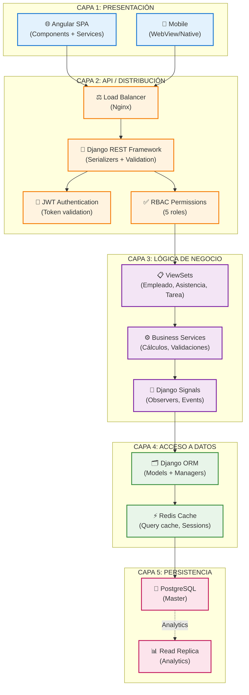

---

## 2️⃣ FLUJO DE UNA SOLICITUD HTTP COMPLETA

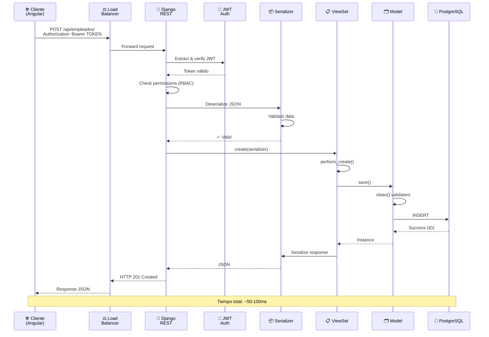

---

## 3️⃣ ARQUITECTURA MULTI-TENANT (Data Isolation)

```mermaid
graph TB
    subgraph "APLICACIÓN COMPARTIDA"
        APP["🔵 Django REST Framework<br/>(Una instancia)"]
    end

    subgraph "BASE DE DATOS ÚNICA"
        DB["💾 PostgreSQL<br/>(Una database)"]
    end

    subgraph "EMPRESA A"
        USER_A["👤 User A<br/>(empresa_id=1)"]
        DATA_A["📊 Datos A<br/>(empresa_id=1)"]
    end

    subgraph "EMPRESA B"
        USER_B["👤 User B<br/>(empresa_id=2)"]
        DATA_B["📊 Datos B<br/>(empresa_id=2)"]
    end

    subgraph "EMPRESA C"
        USER_C["👤 User C<br/>(empresa_id=3)"]
        DATA_C["📊 Datos C<br/>(empresa_id=3)"]
    end

    USER_A -->|request.user.empresa_id=1| APP
    USER_B -->|request.user.empresa_id=2| APP
    USER_C -->|request.user.empresa_id=3| APP

    APP -->|QuerySet.filter(empresa_id=1)| DATA_A
    APP -->|QuerySet.filter(empresa_id=2)| DATA_B
    APP -->|QuerySet.filter(empresa_id=3)| DATA_C

    DATA_A --> DB
    DATA_B --> DB
    DATA_C --> DB

    classDef enterprise fill:#e3f2fd,stroke:#1976d2
    classDef app fill:#fff3e0,stroke:#f57c00
    classDef data fill:#e8f5e9,stroke:#388e3c

    class USER_A,USER_B,USER_C,DATA_A,DATA_B,DATA_C enterprise
    class APP app
    class DB data

    Note over USER_A,DATA_C: Garantía: User A NUNCA ve datos de User B o C
```

---

## 4️⃣ FLUJO DE AUTENTICACIÓN Y AUTORIZACIÓN

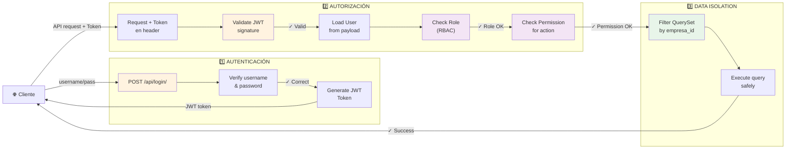

---

## 5️⃣ MÁQUINA DE ESTADOS - SOLICITUD AUSENCIA

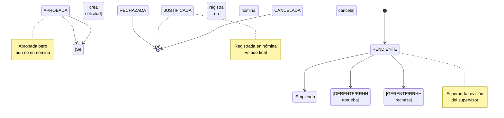

---

## 6️⃣ MÁQUINA DE ESTADOS - TAREA

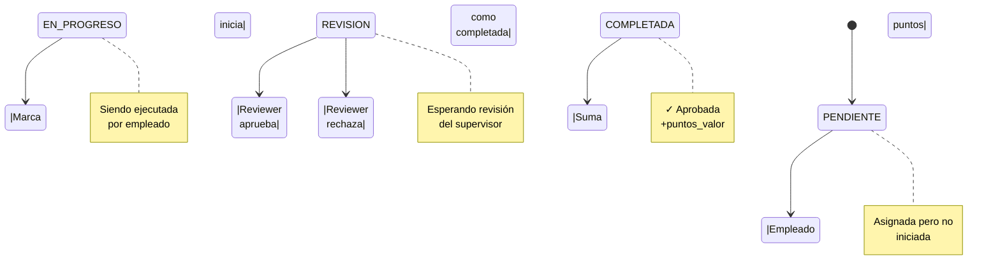

---

## 7️⃣ MÁQUINA DE ESTADOS - JORNADA

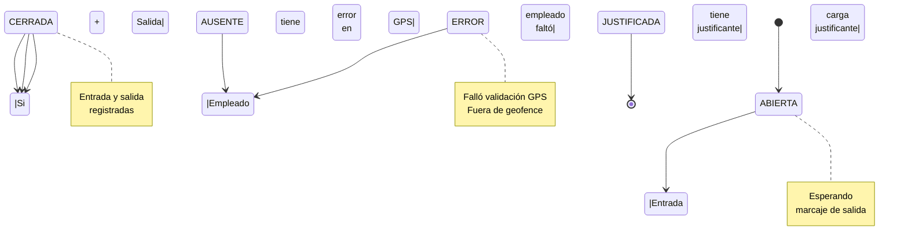

---

## 8️⃣ COMPONENTES DEL SISTEMA

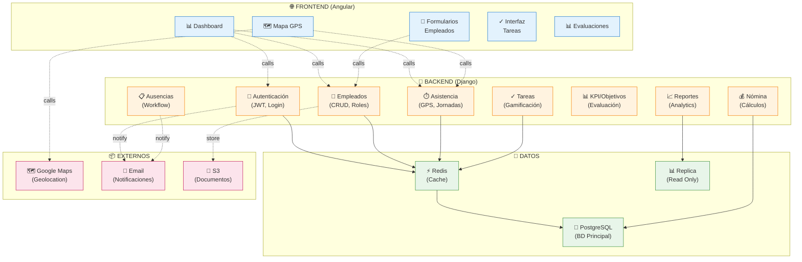

---

## 9️⃣ FLUJO DE ASISTENCIA COMPLETO

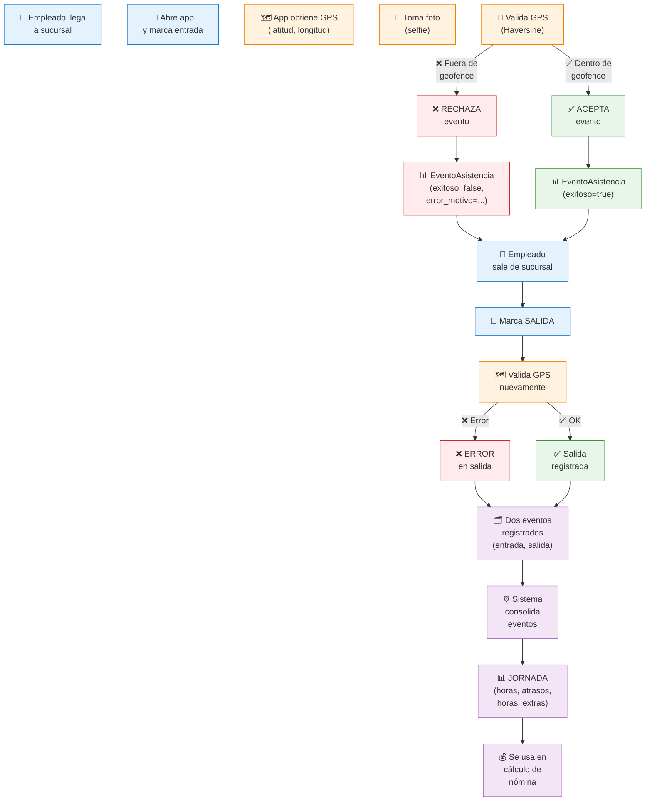

---

## 🔟 CICLO DE NÓMINA

```mermaid
graph LR
    A["📅 Mes actual<br/>(Ej: Enero)"]
    B["⏱️ Recolectar<br/>jornadas"]
    C["📊 Calcular<br/>horas_trabajadas"]
    D["➕ Calcular<br/>horas_extras"]
    E["❌ Calcular<br/>atrasos"]
    F["💰 Aplicar<br/>sueldo base"]
    G["➕ Sumar<br/>HE diurna (1.5x)"]
    H["➕ Sumar<br/>HE nocturna (2.0x)"]
    I["➖ Restar<br/>descuentos"]
    J["📋 Generar<br/>nómina"]
    K["✅ Aprobar<br/>RRHH"]
    L["📊 Registrar<br/>en BD"]
    M["📧 Enviar<br/>empleados"]
    N["💳 Pagar<br/>salarios"]

    A --> B
    B --> C
    C --> D
    D --> E
    E --> F
    F --> G
    G --> H
    H --> I
    I --> J
    J --> K
    K --> L
    L --> M
    M --> N

    classDef input fill:#e3f2fd,stroke:#1976d2
    classDef calc fill:#fff3e0,stroke:#f57c00
    classDef result fill:#e8f5e9,stroke:#388e3c
    classDef final fill:#f3e5f5,stroke:#7b1fa2

    class A input
    class B,C,D,E,F,G,H,I calc
    class J result
    class K,L,M,N final
```

---

## 1️⃣1️⃣ ESCALABILIDAD HORIZONTAL

```mermaid
graph TB
    subgraph "CLIENTES"
        C1["👤 Empresa 1"]
        C2["👤 Empresa 2"]
        C3["👤 Empresa 3"]
        CN["👤 Empresa N"]
    end

    subgraph "CAPA DE DISTRIBUCIÓN"
        LB["⚖️ Load Balancer<br/>(Nginx)<br/>Round-robin"]
    end

    subgraph "APLICACIONES (Stateless)"
        APP1["🔵 Django 1<br/>:8000"]
        APP2["🔵 Django 2<br/>:8001"]
        APP3["🔵 Django 3<br/>:8002"]
        APPN["🔵 Django N<br/>:800N"]
    end

    subgraph "CACHE"
        REDIS["⚡ Redis Cluster<br/>(Session Store,<br/>Query Cache)"]
    end

    subgraph "BASE DE DATOS"
        MASTER["💾 PostgreSQL Master<br/>(Write)"]
        READ1["📊 Read Replica 1"]
        READ2["📊 Read Replica 2"]
    end

    C1 --> LB
    C2 --> LB
    C3 --> LB
    CN --> LB

    LB --> APP1
    LB --> APP2
    LB --> APP3
    LB --> APPN

    APP1 --> REDIS
    APP2 --> REDIS
    APP3 --> REDIS
    APPN --> REDIS

    REDIS --> MASTER
    MASTER --> READ1
    MASTER --> READ2

    classDef client fill:#e3f2fd,stroke:#1976d2
    classDef lb fill:#fff3e0,stroke:#f57c00
    classDef app fill:#f3e5f5,stroke:#7b1fa2
    classDef cache fill:#fce4ec,stroke:#c2185b
    classDef db fill:#e8f5e9,stroke:#388e3c

    class C1,C2,C3,CN client
    class LB lb
    class APP1,APP2,APP3,APPN app
    class REDIS cache
    class MASTER,READ1,READ2 db

    Note over LB,APPN: Scale horizontalmente<br/>añadiendo más instancias
```

---

## 1️⃣2️⃣ SEGURIDAD EN CAPAS

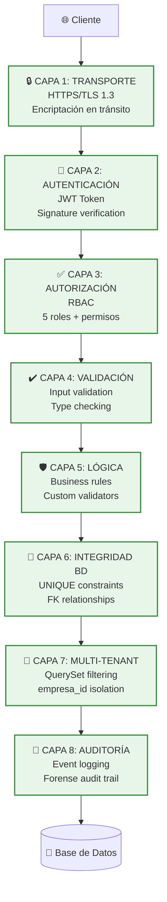

---

## 1️⃣3️⃣ ROLES Y PERMISOS (RBAC)

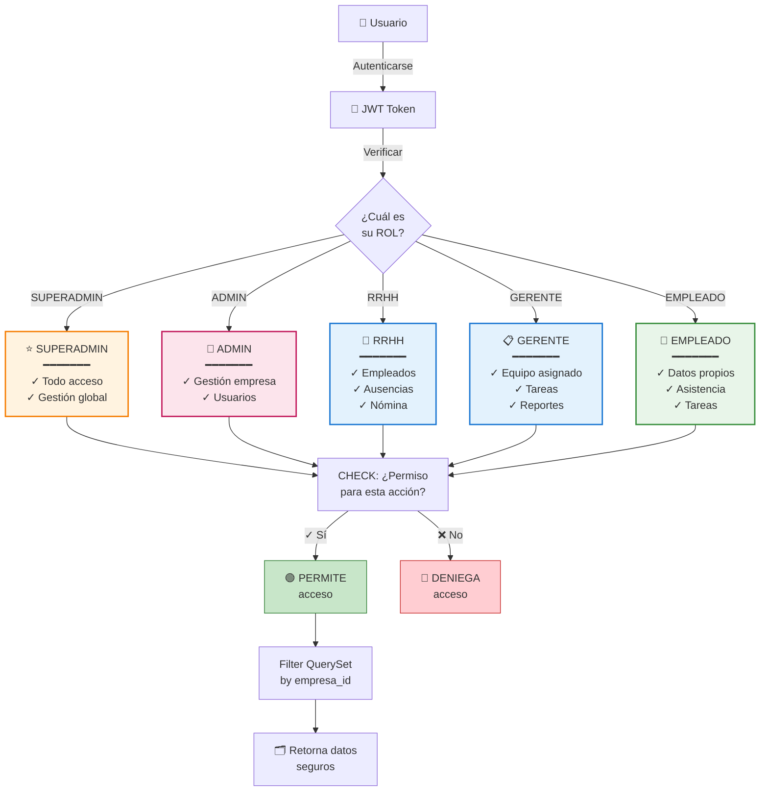

---

## 1️⃣4️⃣ FLUJO DE DATOS COMPLETO

```mermaid
graph LR
    U["👤 Usuario"]
    APP["🌐 APP"]
    API["🔵 API REST"]
    PERM["✅ Permisos"]
    SER["📦 Serializer"]
    VIEW["📋 ViewSet"]
    SVC["⚙️ Service"]
    MODEL["🗂️ Model"]
    MGR["📊 Manager"]
    CACHE["⚡ Cache"]
    DB["💾 Database"]
    
    U -->|Input| APP
    APP -->|HTTP Request| API
    API -->|Verify Token| PERM
    PERM -->|Check Role| VIEW
    VIEW -->|Deserialize| SER
    SER -->|Validate| VIEW
    VIEW -->|Business Logic| SVC
    SVC -->|Query| MODEL
    MODEL -->|Custom Query| MGR
    MGR -->|Check Cache| CACHE
    CACHE -->|Miss| DB
    CACHE -->|Hit| MGR
    DB -->|Result| MGR
    MGR -->|Instances| MODEL
    MODEL -->|Data| SVC
    SVC -->|Result| VIEW
    VIEW -->|Serialize| SER
    SER -->|JSON| API
    API -->|HTTP Response| APP
    APP -->|Display| U

    classDef client fill:#e3f2fd
    classDef api fill:#fff3e0
    classDef logic fill:#f3e5f5
    classDef data fill:#e8f5e9
    classDef storage fill:#fce4ec

    class U,APP client
    class API,PERM api
    class SER,VIEW,SVC,MODEL,MGR logic
    class CACHE storage
    class DB storage
```

---

## 1️⃣5️⃣ MONITOREO Y LOGS

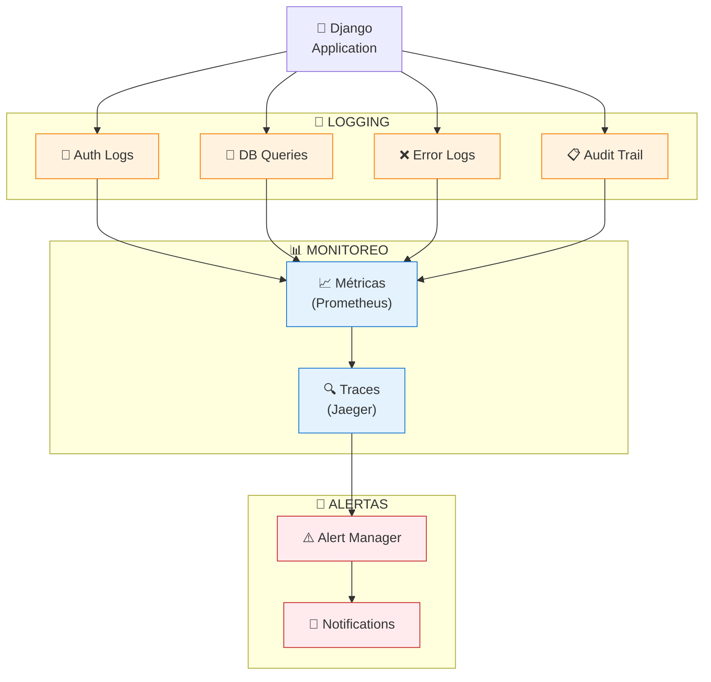

---

## 📦 CÓMO USAR ESTOS DIAGRAMAS

### Opción 1: GitHub / GitLab
```
Copia el código mermaid
Pega en un archivo .md
Commit y push
GitHub/GitLab renderiza automáticamente ✅
```

### Opción 2: VS Code
```
Instala: "Markdown Preview Enhanced"
Ctrl+Shift+V para ver preview
Los diagramas se renderizan en tiempo real ✅
```

### Opción 3: Mermaid Live Editor
```
Ve a: mermaid.live
Pega el código
Edita y exporta como SVG/PNG ✅
```

### Opción 4: Documentación
```
Copia el código en archivo .md
Usa en Sphinx, Confluence, Notion, etc ✅
```

---

## 🎨 DIAGRAMA COMPLETO DEL SISTEMA

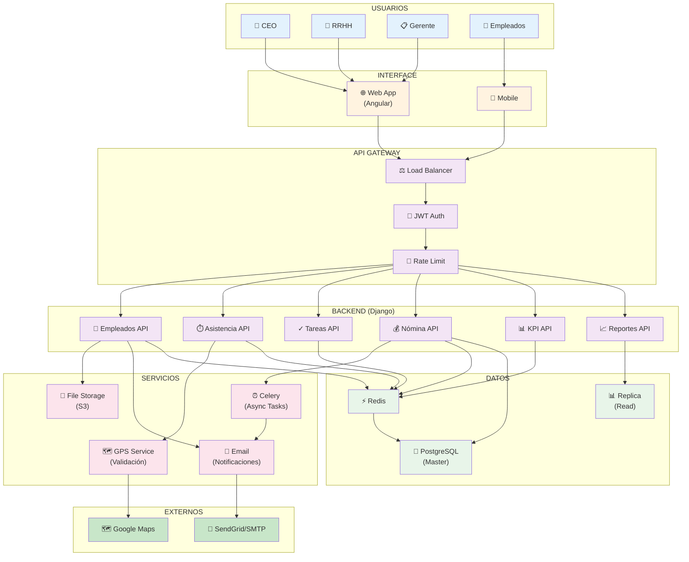

---

**Todos los diagramas están listos para copiar y usar. Elige el que necesites y adaptalo a tu documentación.** 🎨✨
