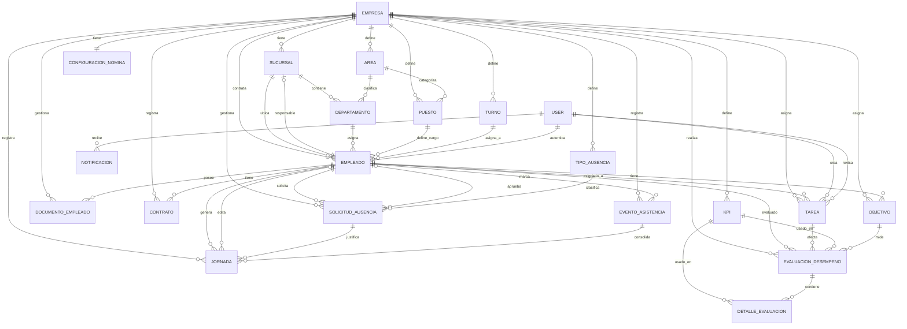
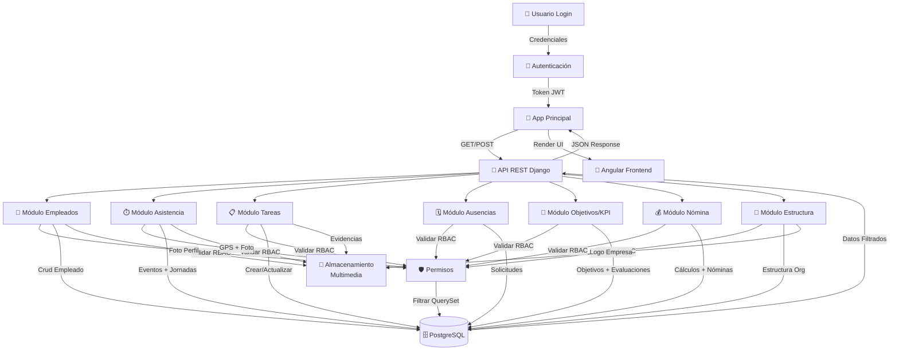
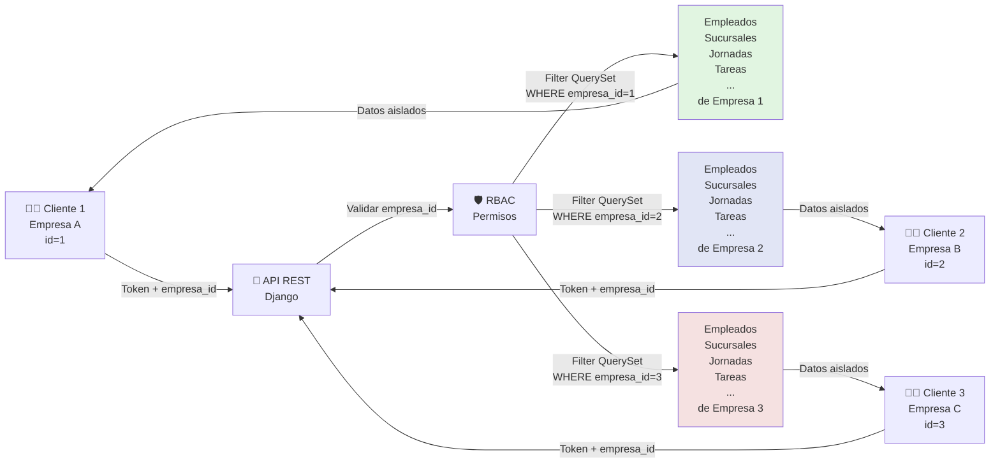
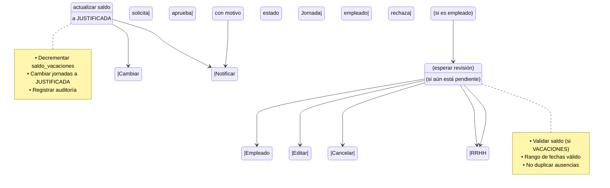
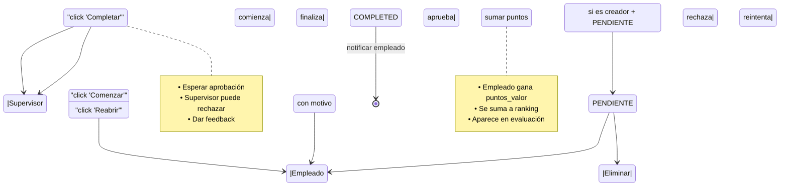
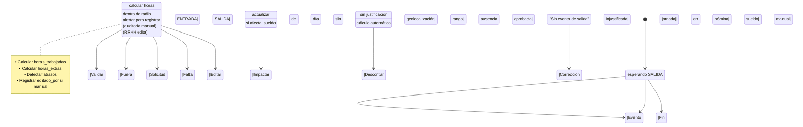
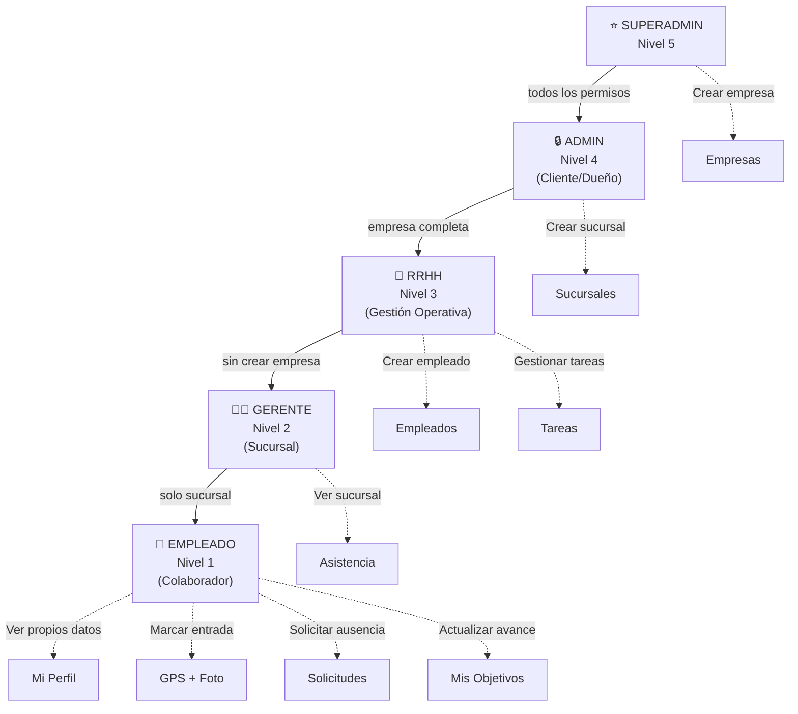
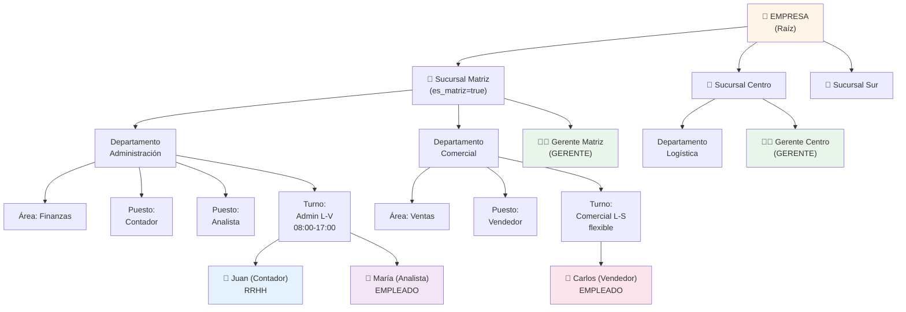
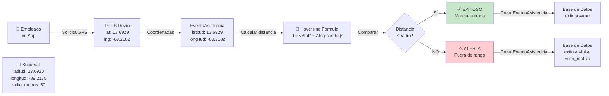

# 📊 DIAGRAMAS MERMAID ADICIONALES - PUNTOPYMES

## 1️⃣ Diagrama Entidad-Relación (ER) Detallado



---

## 2️⃣ Diagrama de Flujo de Datos



---

## 3️⃣ Diagrama de Aislamiento Multi-Tenant



---

## 4️⃣ Diagrama de Estados - Solicitud de Ausencia



---

## 5️⃣ Diagrama de Estados - Tarea



---

## 6️⃣ Diagrama de Estados - Jornada



---

## 7️⃣ Diagrama de Permisos RBAC



---

## 8️⃣ Diagrama de Cálculo de Nómina

```mermaid
graph LR
    EMC["📋 Empleado"] -->|Buscar jornadas| JOR["Jornadas<br/>del mes"]
    
    JOR -->|Sumar| HT["Horas<br/>Trabajadas"]
    JOR -->|Calcular| HE["Horas<br/>Extras"]
    JOR -->|Sumar| ATR["Atrasos<br/>minutos"]
    JOR -->|Contar| FAL["Faltas<br/>completas"]
    
    HT -->|÷ divisor| VH["Valor<br/>Hora"]
    
    HE -->|diurna × 1.5<br/>nocturna × 2.0| HEV["Valor<br/>HE"]
    
    ATR -->|minutos × vh| ATRD["Descto<br/>Atrasos"]
    FAL -->|días × (sb/30)| FALD["Descto<br/>Faltas"]
    
    EMC -->|Sueldo base| SB["Sueldo<br/>Base"]
    
    SB -->|aplica| NETO1["Sueldo Base"]
    HEV -->|aplica| NETO2["+ Horas Extras"]
    ATRD -->|aplica| NETO3["- Atrasos"]
    FALD -->|aplica| NETO4["- Faltas"]
    
    AUS["Ausencias<br/>afecta_sueldo"] -->|restar| NETO5["- Ausencias"]
    BON["Tareas<br/>completadas"] -->|sumar| NETO6["+ Bonificaciones"]
    
    NETO1 --> FINAL["💰 SUELDO NETO"]
    NETO2 --> FINAL
    NETO3 --> FINAL
    NETO4 --> FINAL
    NETO5 --> FINAL
    NETO6 --> FINAL
    
    FINAL -->|Generar| PDF["📄 Recibo PDF"]
```

---

## 9️⃣ Diagrama de Jerarquía Organizacional



---

## 🔟 Diagrama de Geolocalización (Asistencia)



---

## 1️⃣1️⃣ Timeline de Procesos Paralelos

```mermaid
timeline
    title Procesos Simultáneos en Marcaje de Asistencia
    
    section Marcaje
        08:00 : Empleado llega
        08:01 : App solicita GPS
        08:02 : App toma foto
        08:03 : Envía POST /api/eventos-asistencia/
        
    section Backend
        08:03 : Recibe request
        08:04 : Validar token JWT
        08:05 : Validar geolocalización (Haversine)
        08:06 : Crear EventoAsistencia
        08:07 : Si hay entrada+salida anterior: crear Jornada
        08:08 : Calcular horas, atrasos, extras
        08:09 : Guardar en BD
        
    section Respuesta
        08:10 : Frontend recibe response
        08:10 : Mostrar confirmación: "Entrada registrada"
        08:11 : Mostrar hora exacta
```

---

*Diagramas Mermaid - PuntoPymes v2.0*  
*27 de Enero, 2026*
