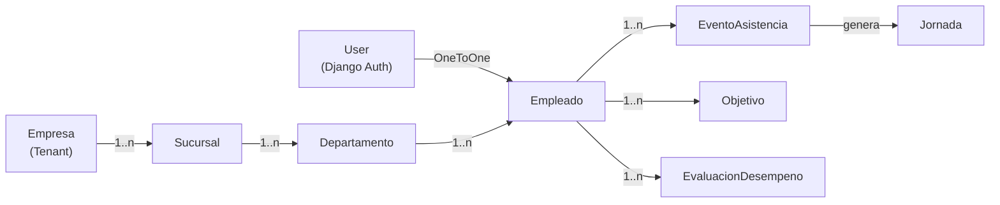

# 📊 DIAGRAMA DE MODELO DE CLASES - PUNTOPYMES

## Visualización Completa del Sistema

```mermaid
classDiagram
    %% ==================== USUARIOS ====================
    class User {
        +int id
        +str username
        +str email
        +str password_hash
        +bool is_active
        +datetime date_joined
        +set_password(password)
        +check_password(password)
    }

    %% ==================== CORE ====================
    class Empresa {
        +int id
        +str razon_social
        +str nombre_comercial
        +str ruc (UNIQUE)
        +str direccion
        +ImageField logo
        +bool estado
        +datetime created_at
        +__str__()
    }

    class Sucursal {
        +int id
        +str nombre
        +str direccion
        +bool es_matriz
        +Decimal latitud
        +Decimal longitud
        +int radio_metros
        +Empresa empresa
        +Empleado responsable
        +__str__()
    }

    class Area {
        +int id
        +str nombre (UNIQUE por empresa)
        +str descripcion
        +Empresa empresa
        +__str__()
    }

    class Departamento {
        +int id
        +str nombre
        +Sucursal sucursal
        +Area area
        +__str__()
    }

    class Puesto {
        +int id
        +str nombre (UNIQUE por empresa)
        +Empresa empresa
        +Area area
        +bool es_supervisor
        +__str__()
    }

    class Turno {
        +int id
        +str nombre
        +Empresa empresa
        +str tipo_jornada (RIGIDO/FLEXIBLE)
        +TimeField hora_entrada
        +TimeField hora_salida
        +int min_tolerancia
        +int horas_semanales_meta
        +list dias_laborables (JSONField)
        +__str__()
    }

    class Notificacion {
        +int id
        +User usuario_destino
        +str titulo
        +str mensaje
        +str tipo (VACACION/OBJETIVO/SISTEMA)
        +bool leida
        +datetime creada_el
        +str link_accion
        +__str__()
    }

    class ConfiguracionNomina {
        +int id
        +Empresa empresa
        +str moneda
        +int divisor_hora_mensual
        +Decimal factor_he_diurna
        +Decimal factor_he_nocturna
        +TimeField hora_inicio_nocturna
        +bool descontar_atrasos
        +bool tolerancia_remunerada
        +__str__()
    }

    %% ==================== PERSONAL ====================
    class Empleado {
        +int id
        +User usuario (OneToOne)
        +str nombres
        +str apellidos
        +str email (UNIQUE por empresa)
        +str telefono
        +str direccion
        +ImageField foto
        +str documento (UNIQUE por empresa)
        +Empresa empresa
        +Sucursal sucursal
        +Departamento departamento
        +Puesto puesto
        +str rol (SUPERADMIN/ADMIN/RRHH/GERENTE/EMPLEADO)
        +DateField fecha_ingreso
        +Decimal sueldo
        +bool es_mensualizado
        +int saldo_vacaciones
        +Turno turno_asignado
        +str estado (ACTIVO/INACTIVO)
        +clean()
        +save()
        +cambiar_rol(nuevo_rol)
        +__str__()
    }

    class DocumentoEmpleado {
        +int id
        +Empresa empresa
        +Empleado empleado
        +str tipo (CONTRATO/CEDULA/TITULO/OTRO)
        +FileField archivo
        +str observacion
        +datetime cargado_el
        +__str__()
    }

    class Contrato {
        +int id
        +Empresa empresa
        +Empleado empleado
        +str tipo (INDEFINIDO/PLAZO_FIJO/PASANTIA)
        +DateField fecha_inicio
        +DateField fecha_fin
        +Decimal salario_mensual
        +FileField archivo_adjunto
        +bool activo
        +save()
        +__str__()
    }

    class Tarea {
        +int id
        +Empresa empresa
        +str titulo
        +str descripcion
        +Empleado asignado_a
        +User creado_por
        +User revisado_por
        +datetime fecha_limite
        +str prioridad (BAJA/MEDIA/ALTA/URGENTE)
        +str estado (PENDIENTE/PROGRESO/REVISION/COMPLETADA)
        +int puntos_valor
        +str motivo_rechazo
        +datetime created_at
        +datetime updated_at
        +datetime completado_at
        +__str__()
    }

    class SolicitudAusencia {
        +int id
        +Empresa empresa
        +Empleado empleado
        +TipoAusencia tipo_ausencia
        +int dias_solicitados
        +DateField fecha_inicio
        +DateField fecha_fin
        +str motivo
        +str estado (PENDIENTE/APROBADA/RECHAZADA)
        +DateField fecha_resolucion
        +str motivo_rechazo
        +Empleado aprobado_por
        +__str__()
    }

    class TipoAusencia {
        +int id
        +Empresa empresa
        +str nombre
        +bool afecta_sueldo
        +__str__()
    }

    %% ==================== ASISTENCIA ====================
    class EventoAsistencia {
        +int id
        +Empresa empresa
        +Empleado empleado
        +str tipo (ENTRADA/SALIDA)
        +datetime timestamp
        +Decimal latitud
        +Decimal longitud
        +ImageField foto
        +str ip_address
        +str device_info
        +bool exitoso
        +str error_motivo
        +__str__()
    }

    class Jornada {
        +int id
        +Empresa empresa
        +Empleado empleado
        +DateField fecha
        +datetime entrada
        +datetime salida
        +Decimal horas_trabajadas
        +Decimal horas_extras
        +int minutos_atraso
        +bool es_atraso
        +str estado (ABIERTA/CERRADA/AUSENTE/JUSTIFICADA/ERROR)
        +bool es_manual
        +str observacion
        +Empleado editado_por
        +calcular_duracion()
        +__str__()
    }

    %% ==================== KPI ====================
    class KPI {
        +int id
        +Empresa empresa
        +str nombre
        +str descripcion
        +str categoria (ASISTENCIA/DESEMPENO/COMPETENCIA/OTRO)
        +int peso_porcentaje
        +Decimal meta_objetivo
        +__str__()
    }

    class Objetivo {
        +int id
        +Empresa empresa
        +Empleado empleado
        +str titulo
        +str descripcion
        +Decimal meta_numerica
        +Decimal avance_actual
        +DateField fecha_limite
        +str estado (PENDIENTE/EN_PROGRESO/COMPLETADO/CANCELADO)
        +str prioridad (ALTA/MEDIA/BAJA)
        +__str__()
    }

    class EvaluacionDesempeno {
        +int id
        +Empresa empresa
        +Empleado empleado
        +DateField fecha_evaluacion
        +str periodo
        +Decimal puntaje_total
        +str estado (BORRADOR/FINALIZADA)
        +str observaciones
        +__str__()
    }

    class DetalleEvaluacion {
        +int id
        +EvaluacionDesempeno evaluacion
        +KPI kpi
        +Decimal valor_obtenido
        +Decimal calificacion
        +str comentario
    }

    %% ==================== RELACIONES ====================
    
    %% User
    User "1" -- "1" Empleado : usuario
    
    %% Empresa
    Empresa "1" -- "*" Sucursal : sucursales
    Empresa "1" -- "*" Area : areas
    Empresa "1" -- "*" Puesto : puestos
    Empresa "1" -- "*" Turno : turnos
    Empresa "1" -- "*" Empleado : empleados
    Empresa "1" -- "*" DocumentoEmpleado : documentos
    Empresa "1" -- "*" Contrato : contratos
    Empresa "1" -- "*" EventoAsistencia : eventos
    Empresa "1" -- "*" Jornada : jornadas
    Empresa "1" -- "*" TipoAusencia : tipos_ausencia
    Empresa "1" -- "*" SolicitudAusencia : solicitudes_ausencia
    Empresa "1" -- "*" Tarea : tareas
    Empresa "1" -- "*" KPI : kpis
    Empresa "1" -- "*" Objetivo : objetivos
    Empresa "1" -- "*" EvaluacionDesempeno : evaluaciones
    Empresa "1" -- "1" ConfiguracionNomina : config_nomina

    %% Sucursal
    Sucursal "1" -- "*" Departamento : departamentos
    Sucursal "1" -- "*" EventoAsistencia : eventos
    Sucursal "1" -- "*" Jornada : jornadas
    Sucursal "0..1" -- "*" Empleado : empleados
    Sucursal "1" -- "0..1" Empleado : responsable

    %% Area
    Area "1" -- "*" Departamento : departamentos
    Area "1" -- "*" Puesto : puestos

    %% Departamento
    Departamento "1" -- "*" Empleado : empleados

    %% Puesto
    Puesto "1" -- "*" Empleado : empleados

    %% Turno
    Turno "1" -- "*" Empleado : empleados_asignados

    %% Empleado
    Empleado "1" -- "*" DocumentoEmpleado : documentos
    Empleado "1" -- "*" Contrato : contratos
    Empleado "1" -- "*" EventoAsistencia : eventos
    Empleado "1" -- "*" Jornada : jornadas
    Empleado "1" -- "*" SolicitudAusencia : solicitudes
    Empleado "1" -- "*" Tarea : tareas_asignadas
    Empleado "1" -- "*" SolicitudAusencia : ausencias_aprobadas
    Empleado "1" -- "*" Jornada : jornadas_editadas
    Empleado "1" -- "*" Objetivo : objetivos
    Empleado "1" -- "*" EvaluacionDesempeno : evaluaciones

    %% TipoAusencia
    TipoAusencia "1" -- "*" SolicitudAusencia : solicitudes

    %% Tarea
    User "1" -- "*" Tarea : creadas
    User "0..1" -- "*" Tarea : revisadas

    %% SolicitudAusencia
    SolicitudAusencia "0..1" -- "*" Empleado : aprobadas_por

    %% KPI
    KPI "1" -- "*" DetalleEvaluacion : detalles

    %% Evaluacion
    EvaluacionDesempeno "1" -- "*" DetalleEvaluacion : detalles

    %% Notificacion
    User "1" -- "*" Notificacion : notificaciones
```



---

## 📋 Leyenda de Relaciones

```
"1" -- "*"    = Uno a Muchos (OneToMany / ForeignKey)
"1" -- "1"    = Uno a Uno (OneToOne)
"0..1" -- "*" = Cero o Uno a Muchos (Nullable FK)
"1" -- "0..1" = Uno a Cero o Uno (Nullable FK)
```

---

## 🎯 Explicación de Módulos

### 📍 Core (Estructura Organizacional)
- **Empresa**: Raíz del árbol SaaS (tenant)
- **Sucursal**: Ubicaciones físicas
- **Departamento**: Unidades operativas por sucursal
- **Área**: Unidades funcionales globales
- **Puesto**: Definición de cargos
- **Turno**: Reglas de horarios
- **ConfiguracionNomina**: Parámetros de cálculo

### 👤 Personal (Recursos Humanos)
- **Empleado**: Usuario del sistema con rol
- **Contrato**: Vinculación laboral
- **DocumentoEmpleado**: Archivos del empleado
- **Tarea**: Asignaciones de trabajo
- **SolicitudAusencia**: Permisos/vacaciones

### ⏱️ Asistencia (Control Horario)
- **EventoAsistencia**: Bitácora de marcajes (RAW DATA)
- **Jornada**: Consolidado diario (datos de nómina)

### 🎯 KPI (Productividad)
- **KPI**: Catálogo de indicadores
- **Objetivo**: Metas individuales
- **EvaluacionDesempeno**: Evaluación mensual
- **DetalleEvaluacion**: Calificación por KPI

### 🔔 Sistema
- **Notificacion**: Alertas del sistema
- **User**: Autenticación Django

---

## 💡 Características Destacadas

### Relaciones Importantes
```
✅ User (Django) ↔ Empleado (OneToOne)
✅ Empresa ↔ Sucursal ↔ Departamento (Jerarquía)
✅ Sucursal ↔ Empleado (Multi-ubicación)
✅ Empleado ↔ EventoAsistencia (Auditoría forense)
✅ Empleado ↔ Jornada (Nómina)
✅ Empleado ↔ Objetivo (Productividad)
✅ EvaluacionDesempeno ↔ DetalleEvaluacion ↔ KPI (Escalas)
```

### Campos Especiales
- 🔐 **Unique constraints**: (empresa, email), (empresa, documento)
- 📍 **GPS**: latitud, longitud en EventoAsistencia
- 📸 **Multimedia**: foto en Empleado, DocumentoEmpleado, EventoAsistencia
- 📊 **JSONField**: dias_laborables en Turno
- 💰 **Decimal**: Presición de dinero y cálculos

### Métodos Custom
```python
Empleado.cambiar_rol()           # Cambio seguro de rol
Empleado.clean()                 # Validaciones jerárquicas
Contrato.save()                  # Auto-reemplaza contrato anterior
Jornada.calcular_duracion()      # Convierte a decimales
```

---

## 🔗 Vista Simplificada (Solo Relaciones)



---

## 📐 Normalización

- ✅ **3NF** (Tercera Forma Normal)
- ✅ **Índices** en queries frecuentes: (empleado, timestamp), (empleado, fecha)
- ✅ **Constraints** únicos para integridad
- ✅ **Cascadas** apropiadas (CASCADE/SET_NULL)
- ✅ **JSONField** para flexibilidad (dias_laborables)

---

*Diagrama generado con Mermaid*  
*27 de Enero, 2026*
