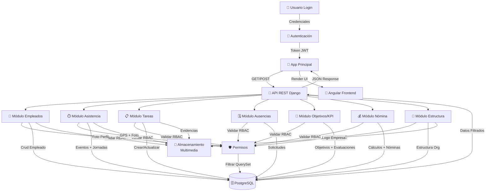

# 📋 Informe de Arquitectura del Sistema PuntoPymes

**Fecha de Elaboración**: 30 de Enero, 2026  
**Versión del Proyecto**: v2.0 Production-Ready Enterprise  
**Elaborado por**: GitHub Copilot (Desarrollador Senior)  
**Estado del Proyecto**: ✅ 100% Completado y Funcional

---

## 1. Introducción

### 1.1. Propósito

El propósito de este documento es proporcionar una descripción completa y estructurada de la arquitectura del sistema **PuntoPymes**, una solución SaaS (Software as a Service) empresarial diseñada para la gestión integral de recursos humanos en pequeñas y medianas empresas (Pymes). El sistema facilita la administración de empleados, control de asistencia, gestión de tareas, solicitudes de ausencia, objetivos y KPIs, nómina, reportes y estructura organizacional, con un enfoque en seguridad, escalabilidad y aislamiento de datos multi-tenant.

Este informe tiene como objetivo principal:
- Documentar la arquitectura técnica adoptada.
- Describir las decisiones de diseño y patrones implementados.
- Proporcionar vistas múltiples de la arquitectura para diferentes stakeholders.
- Servir como referencia para mantenimiento, evolución y auditorías futuras.

### 1.2. Ámbito

Este documento cubre la arquitectura completa del sistema PuntoPymes, incluyendo:
- Arquitectura de software (N-Tier, SaaS multi-tenant).
- Stack tecnológico (Django, Angular, PostgreSQL).
- Sistema de roles y permisos (RBAC avanzado).
- Seguridad y aislamiento de datos.
- Componentes frontend y backend.
- APIs REST y integraciones.
- Despliegue y infraestructura.

El ámbito se limita a la versión actual (v2.0) del sistema, excluyendo futuras expansiones o módulos no implementados.

### 1.3. Definiciones, Acrónimos y Abreviaturas

| Término | Definición |
|---------|------------|
| **SaaS** | Software as a Service: Modelo de distribución de software donde el proveedor aloja la aplicación y la pone a disposición de los clientes a través de internet. |
| **RBAC** | Role-Based Access Control: Control de acceso basado en roles, donde los permisos se asignan a roles en lugar de usuarios individuales. |
| **Multi-Tenancy** | Arquitectura multi-tenant: Una sola instancia de la aplicación sirve a múltiples clientes (tenants), con aislamiento de datos. |
| **N-Tier** | Arquitectura en capas: Separación lógica de la aplicación en capas (presentación, lógica, datos). |
| **JWT** | JSON Web Token: Estándar para la creación de tokens de acceso que permiten la propagación de identidad y privilegios. |
| **ORM** | Object-Relational Mapping: Técnica de programación para convertir datos entre sistemas incompatibles (bases de datos relacionales y lenguajes de programación orientados a objetos). |
| **SPA** | Single Page Application: Aplicación web que se carga una sola vez y actualiza dinámicamente el contenido. |
| **REST** | Representational State Transfer: Estilo de arquitectura para sistemas distribuidos, comúnmente usado en APIs web. |
| **ViewSet** | En Django REST Framework: Clase que proporciona operaciones CRUD automáticas para un modelo. |
| **Serializer** | En Django REST Framework: Clase que convierte objetos complejos (como instancias de modelos) en tipos de datos nativos de Python que pueden ser fácilmente renderizados en JSON. |
| **Tenant** | Cliente o empresa que utiliza la aplicación SaaS. |
| **Row-Level Security** | Seguridad a nivel de fila: Restricción de acceso a registros específicos en la base de datos basada en el rol del usuario. |

### 1.4. Referencias

- **Django Documentation**: https://docs.djangoproject.com/
- **Django REST Framework Documentation**: https://www.django-rest-framework.org/
- **Angular Documentation**: https://angular.io/docs
- **PostgreSQL Documentation**: https://www.postgresql.org/docs/
- **RBAC Standard (NIST)**: https://csrc.nist.gov/publications/detail/sp/800-162/final
- **REST API Design Guidelines**: https://restfulapi.net/
- **Documentos del Proyecto**:
  - ANALISIS_COMPLETO_PROYECTO.md
  - ARQUITECTURA_ESTILOS_PATRONES.md
  - IMPLEMENTACION_RBAC_COMPLETA.md
  - DIAGRAMAS_MERMAID_COMPLETOS.md

---

## 2. Representación de la Arquitectura

### 2.1. Vista de Escenarios

La vista de escenarios describe los casos de uso principales y flujos de usuario en el sistema PuntoPymes. Los escenarios se clasifican por rol de usuario y módulo funcional.

#### Escenarios por Rol

**1. Superadministrador SaaS**
- Gestión técnica de la plataforma completa.
- Acceso a todas las empresas y datos.
- Configuración global del sistema.
- Monitoreo y mantenimiento.

**2. Administrador (Cliente/Dueño)**
- Gestión completa de su empresa.
- Creación y edición de empleados, sucursales, departamentos.
- Aprobación de solicitudes de ausencia.
- Visualización de reportes globales.

**3. Recursos Humanos (RRHH)**
- Gestión operativa de personal.
- Creación de empleados y asignación de roles.
- Gestión de nómina y evaluaciones.
- Aprobación de solicitudes de ausencia.

**4. Gerente de Sucursal**
- Supervisión local de su sucursal.
- Gestión de empleados bajo su responsabilidad.
- Asignación de tareas y objetivos.
- Aprobación de solicitudes de ausencia locales.

**5. Empleado**
- Acceso limitado a sus propios datos.
- Marcaje de asistencia con GPS.
- Solicitud de ausencias.
- Visualización de tareas y objetivos asignados.

#### Flujos de Procesos Principales

**Flujo de Autenticación:**
1. Usuario ingresa credenciales.
2. Sistema valida contra base de datos.
3. Genera token JWT con empresa_id y rol.
4. Usuario accede a módulos según permisos.

**Flujo de Gestión de Empleados:**
1. Usuario con permisos crea/edita empleado.
2. Sistema valida permisos RBAC.
3. Aplica filtros de aislamiento multi-tenant.
4. Actualiza base de datos y notifica cambios.

**Flujo de Control de Asistencia:**
1. Empleado marca entrada/salida con GPS.
2. Sistema valida ubicación y horario.
3. Registra evento y consolida jornada.
4. Actualiza estadísticas en tiempo real.

**Flujo de Solicitudes de Ausencia:**
1. Empleado solicita ausencia.
2. Sistema asigna automáticamente al gerente correspondiente.
3. Gerente aprueba/rechaza.
4. Sistema actualiza saldo y jornadas justificadas.

### 2.2. Vista Lógica

La vista lógica describe la estructura de componentes y sus relaciones, organizada en capas según el patrón N-Tier.

#### Arquitectura en Capas

```
┌─────────────────────────────────────────────────────────────┐
│                    CAPA DE PRESENTACIÓN                     │
│  (Angular 18+ - Standalone Components, Tailwind CSS v3+)   │
│  - Componentes UI (EmpleadoList, AsistenciaForm, etc.)     │
│  - Servicios (AuthService, ApiService)                     │
│  - Guardianes (authGuard, roleBasedGuard)                  │
├─────────────────────────────────────────────────────────────┤
│                  CAPA DE SERVICIOS                          │
│  (AuthService, ApiService, CustomValidators)              │
├─────────────────────────────────────────────────────────────┤
│                   CAPA DE GUARDIANES                        │
│  (authGuard, roleBasedGuard, adminGuard, configGuard)     │
├─────────────────────────────────────────────────────────────┤
│                   CAPA DE PRESENTACIÓN API                  │
│     (Django REST Framework ViewSets + Serializers)         │
│  - EmpleadoViewSet, AsistenciaViewSet, TareaViewSet        │
├─────────────────────────────────────────────────────────────┤
│                   CAPA DE LÓGICA EMPRESARIAL                │
│  (Django Models, Servicios, Permisos Centralizados)       │
│  - Modelos: Empleado, Empresa, Sucursal, etc.              │
│  - Managers personalizados con filtros multi-tenant        │
├─────────────────────────────────────────────────────────────┤
│                   CAPA DE PERSISTENCIA                      │
│          (PostgreSQL - Esquema Multi-Tenant)               │
│  - Tablas con empresa_id para aislamiento                  │
└─────────────────────────────────────────────────────────────┘
```

#### Componentes Principales

**Backend (Django):**
- **Modelos**: Empleado, Empresa, Sucursal, Departamento, Tarea, SolicitudAusencia, etc.
- **ViewSets**: EmpleadoViewSet, AsistenciaViewSet, TareaViewSet, etc.
- **Serializers**: EmpleadoSerializer, EventoAsistenciaSerializer, etc.
- **Permisos**: CustomPermission classes para RBAC.
- **Managers**: Custom managers con filtros empresa_id.

**Frontend (Angular):**
- **Componentes**: EmpleadoListComponent, AsistenciaFormComponent, etc.
- **Servicios**: AuthService, ApiService, NotificationService.
- **Guardianes**: AuthGuard, RoleBasedGuard, AdminGuard.
- **Modelos**: Interfaces TypeScript para tipado fuerte.

#### Relaciones entre Componentes

- Los ViewSets del backend consumen Serializers para transformación de datos.
- Los Serializers validan datos y aplican permisos RBAC.
- Los Managers aplican filtros de aislamiento multi-tenant a nivel de QuerySet.
- Los componentes frontend consumen APIs REST via servicios Angular.
- Los guardianes controlan navegación y acceso a rutas.

### 2.3. Vista de Procesos

La vista de procesos describe los flujos de trabajo y procesos de negocio implementados.

#### Diagrama de Flujo de Datos General



#### Procesos de Negocio Clave

**1. Proceso de Solicitudes de Ausencia:**
- Empleado crea solicitud → Validación de saldo y fechas → Asignación automática a gerente → Aprobación/rechazo → Actualización de jornadas.

**2. Proceso de Control de Asistencia:**
- Marcaje GPS → Validación de ubicación → Registro de evento → Consolidación de jornada → Cálculo de horas trabajadas.

**3. Proceso de Gestión de Tareas:**
- Creación/asignación → Ejecución por empleado → Revisión por supervisor → Aprobación/completado → Actualización de KPIs.

**4. Proceso de Evaluación de Desempeño:**
- Definición de objetivos → Seguimiento → Evaluación periódica → Cálculo de KPIs → Generación de reportes.

### 2.4. Vista de Implementación/Desarrollo

La vista de implementación describe cómo se organiza el código y los módulos de desarrollo.

#### Estructura de Directorios Backend (Django)

```
punto_pymes/
├── apps/
│   ├── accounts/          # Autenticación y usuarios
│   ├── empleados/         # Gestión de empleados
│   ├── asistencia/        # Control de asistencia
│   ├── tareas/            # Gestión de tareas
│   ├── ausencias/         # Solicitudes de ausencia
│   ├── objetivos/         # Objetivos y KPIs
│   ├── nominas/           # Cálculos de nómina
│   ├── estructura/        # Sucursales, departamentos
│   └── core/              # Configuraciones compartidas
├── config/
│   ├── settings/          # Configuraciones por entorno
│   ├── urls.py            # Rutas principales
│   └── wsgi.py            # Configuración WSGI
├── static/                # Archivos estáticos
├── media/                 # Archivos multimedia
└── manage.py
```

#### Estructura de Directorios Frontend (Angular)

```
frontend/
├── src/
│   ├── app/
│   │   ├── core/              # Servicios core (auth, api)
│   │   ├── shared/            # Componentes compartidos
│   │   ├── features/          # Módulos funcionales
│   │   │   ├── empleados/     # Gestión empleados
│   │   │   ├── asistencia/    # Control asistencia
│   │   │   ├── tareas/        # Gestión tareas
│   │   │   ├── ausencias/     # Solicitudes ausencia
│   │   │   ├── objetivos/     # Objetivos/KPIs
│   │   │   ├── nominas/       # Nómina
│   │   │   └── estructura/    # Estructura org
│   │   ├── guards/            # Guardianes de rutas
│   │   └── models/            # Interfaces TypeScript
│   ├── assets/                # Recursos estáticos
│   ├── environments/          # Configuraciones entorno
│   └── styles/                # Estilos globales
├── dist/                      # Build output
└── angular.json
```

#### Tecnologías y Frameworks

**Backend:**
- Django 5.2.8
- Django REST Framework 3.16.1
- PostgreSQL
- JWT para autenticación
- django-filter para filtrado
- django-cors-headers para CORS

**Frontend:**
- Angular 18+
- TypeScript
- RxJS para programación reactiva
- Tailwind CSS para estilos
- Angular Material para componentes UI

#### Patrón de Desarrollo

- **Backend**: Patrón MVT (Model-View-Template) con ViewSets para APIs REST.
- **Frontend**: Patrón MVC con componentes standalone.
- **Separación**: Frontend y backend completamente desacoplados.
- **Type Safety**: TypeScript en frontend, Python tipado en backend.

### 2.5. Vista de Física

La vista física describe el despliegue y la infraestructura del sistema.

#### Arquitectura de Despliegue

```
┌─────────────────────────────────────────────────────────────┐
│                    USUARIOS FINALES                         │
│  (Navegadores Web - Desktop/Mobile)                        │
├─────────────────────────────────────────────────────────────┤
│                 LOAD BALANCER (Nginx)                       │
│  - Distribución de carga                                    │
│  - SSL Termination                                         │
│  - Caché estático                                          │
├─────────────────────────────────────────────────────────────┤
│                 SERVIDORES DE APLICACIÓN                    │
│  ┌─────────────────────────────────────────────────────┐   │
│  │              CONTENEDOR DOCKER                      │   │
│  │  ┌─────────────────────────────────────────────┐   │   │
│  │  │         DJANGO APPLICATION                   │   │   │
│  │  │  - Gunicorn WSGI Server                     │   │   │
│  │  │  - Django App                               │   │   │
│  │  └─────────────────────────────────────────────┘   │   │
│  └─────────────────────────────────────────────────────┘   │
├─────────────────────────────────────────────────────────────┤
│                 BASE DE DATOS                               │
│  ┌─────────────────────────────────────────────────────┐   │
│  │              POSTGRESQL SERVER                      │   │
│  │  - Base de datos multi-tenant                      │   │
│  │  - Índices optimizados                             │   │
│  │  - Replicación (opcional)                          │   │
│  └─────────────────────────────────────────────────────┘   │
├─────────────────────────────────────────────────────────────┤
│                 ALMACENAMIENTO MULTIMEDIA                   │
│  ┌─────────────────────────────────────────────────────┐   │
│  │              AWS S3 / MINIO                        │   │
│  │  - Fotos de perfil                                 │   │
│  │  - Evidencias de tareas                            │   │
│  │  - Logos de empresa                                │   │
│  └─────────────────────────────────────────────────────┘   │
├─────────────────────────────────────────────────────────────┤
│                 INFRAESTRUCTURA CLOUD                       │
│  (AWS/GCP/Azure - VMs, Containers, Storage)                │
└─────────────────────────────────────────────────────────────┘
```

#### Componentes de Infraestructura

**Servidores de Aplicación:**
- Contenedores Docker para portabilidad.
- Gunicorn como servidor WSGI.
- Nginx como proxy reverso y balanceador de carga.

**Base de Datos:**
- PostgreSQL como motor principal.
- Esquema multi-tenant con empresa_id.
- Índices optimizados para consultas RBAC.
- Backup automático y replicación opcional.

**Almacenamiento:**
- AWS S3 o MinIO para archivos multimedia.
- CDN para distribución global de assets estáticos.

**Seguridad:**
- SSL/TLS para todas las comunicaciones.
- Firewalls a nivel de red.
- Encriptación de datos sensibles.
- Monitoreo de logs y alertas.

#### Escalabilidad

- **Horizontal**: Múltiples instancias de aplicación detrás de load balancer.
- **Vertical**: Aumento de recursos de servidores según demanda.
- **Base de Datos**: Replicación read/write, particionamiento por tenant si necesario.
- **Caché**: Redis para sesiones y datos frecuentemente accedidos.

---

Este informe proporciona una visión completa de la arquitectura del sistema PuntoPymes, sirviendo como base para el entendimiento, mantenimiento y evolución futura del proyecto.</content>
<parameter name="filePath">c:\Users\mateo\Desktop\PuntoPymes\INFORME_ARQUITECTURA_PUNTOPYMES.md